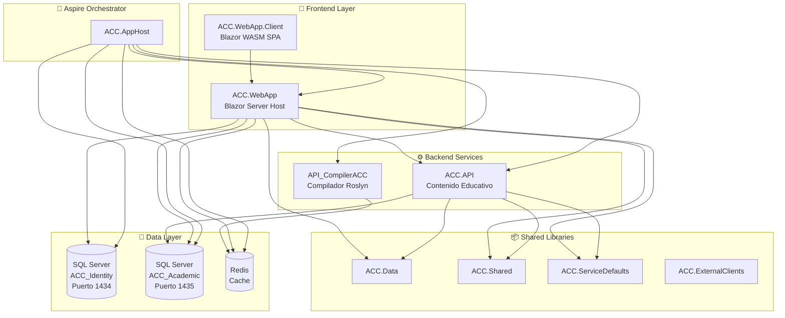
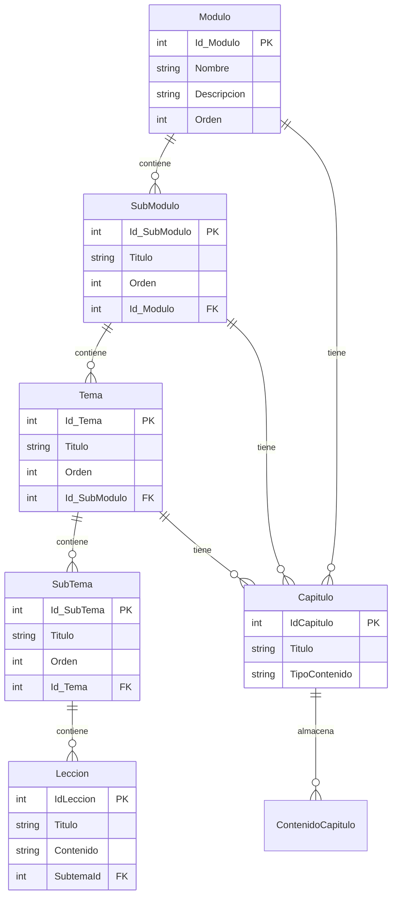
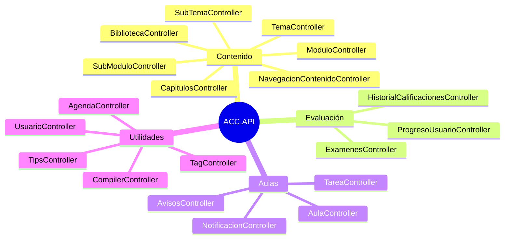
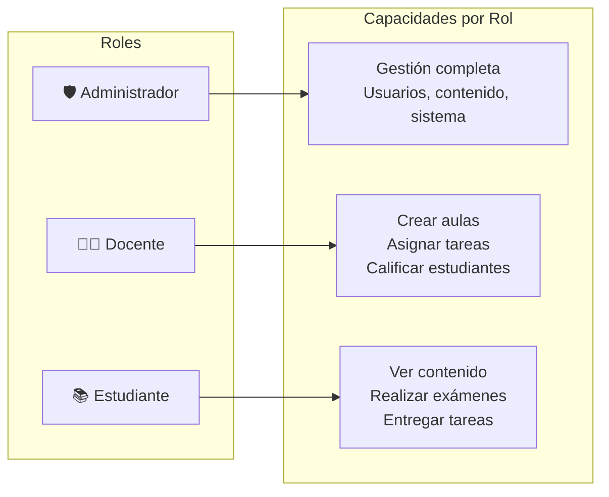

# 🦈 ACC-Complex - Resumen Completo del Repositorio

> **ACC (Aprendiendo C# con Charp)** - Plataforma educativa interactiva para aprender C# de forma progresiva y motivadora.

---

## 📋 Resumen Ejecutivo

ACC-Complex es una plataforma educativa completa desarrollada con **.NET 8, Blazor WebAssembly, y .NET Aspire** que permite a estudiantes aprender el lenguaje C# de manera interactiva. Incluye compilación de código en tiempo real con Roslyn, gestión de aulas virtuales, sistema de exámenes, y un asistente de IA educativa llamado "Charp".

---

## 🏗️ Arquitectura del Sistema



### 🔑 Características Arquitectónicas

| Aspecto | Implementación |
|---------|----------------|
| **Patrón** | Clean Architecture Distribuida |
| **Orquestación** | .NET Aspire |
| **Base de Datos** | Dual SQL Server (Identity + Academic) |
| **Caché** | Redis |
| **Telemetría** | OpenTelemetry + Serilog |
| **Resiliencia** | Retry policies integradas |
| **Autenticación** | ASP.NET Identity con roles |

---

## 🗂️ Estructura de Proyectos

### Backend

| Proyecto | Ubicación | Propósito |
|----------|-----------|-----------|
| ACC.API | `src/ACC.API` | API REST para gestión de contenido educativo |
| ACC.AppHost | `src/ACC.AppHost` | Orquestador Aspire |
| ACC.Data | `src/ACC.Data` | Entity Framework DbContext y entidades |
| ACC.Shared | `src/ACC.Shared` | DTOs, interfaces, enums compartidos |
| ACC.ServiceDefaults | `ACC.ServiceDefaults` | Health checks, telemetría, service discovery |
| ACC.ExternalClients | `src/ACC.ExternalClients` | Integración con servicios externos (IA) |

### Frontend

| Proyecto | Ubicación | Propósito |
|----------|-----------|-----------|
| ACC.WebApp | `ACC.WebApp/ACC.WebApp` | Blazor Server Host + Autenticación |
| ACC.WebApp.Client | `ACC.WebApp/ACC.WebApp.Client` | Blazor WebAssembly SPA |

### Testing

| Proyecto | Ubicación | Propósito |
|----------|-----------|-----------|
| ACC.Tests | `tests/ACC.Tests` | Pruebas unitarias con xUnit + Moq |

---

## 📊 Modelo de Datos (40 Entidades)

### Jerarquía de Contenido Educativo



### Categorías de Entidades

#### 📚 Contenido Educativo (10 entidades)
| Entidad | Descripción |
|---------|-------------|
| `Modulo` | Módulos principales del curso |
| `SubModulo` | Submódulos dentro de módulos |
| `Tema` | Temas dentro de submódulos |
| `SubTema` | Subtemas dentro de temas |
| `Leccion` | Lecciones atómicas de contenido |
| `Capitulo` | Capítulos teóricos/prácticos |
| `ContenidoCapitulo` | HTML/JSON del contenido |
| `Tag`, `ModuloTags`, `TemaTags`, `CapituloTags` | Sistema de etiquetado |

#### 👤 Usuarios y Progreso (10 entidades)
| Entidad | Descripción |
|---------|-------------|
| `Usuario` | Datos académicos del usuario |
| `ProgresoUsuario` | Progreso por subtema |
| `UsuarioModulos` | Relación usuario-módulo |
| `UsuarioSubModulos` | Relación usuario-submódulo |
| `UsuarioTemas` | Relación usuario-tema |
| `UsuarioSubTemas` | Relación usuario-subtema |
| `HistorialCalificaciones` | Historial de notas |
| `Notificacion` | Notificaciones del sistema |
| `Auditoria` | Registro de acciones |
| `Agenda` | Agenda personal |

#### 🎓 Aulas Virtuales (7 entidades)
| Entidad | Descripción |
|---------|-------------|
| `Aula` | Aulas creadas por docentes |
| `AulaEstudiante` | Inscripción de estudiantes |
| `InvitacionAula` | Invitaciones por token |
| `Anuncio` | Anuncios del docente |
| `Tarea` | Tareas asignadas por docentes |
| `TareaAsignacion` | Asignación individual |
| `Evaluacion`, `EvaluacionResultado` | Evaluaciones y resultados |

#### 📝 Exámenes (7 entidades)
| Entidad | Descripción |
|---------|-------------|
| `Examen` | Exámenes generales |
| `ExamenModulo` | Exámenes por módulo |
| `ExamenSubModulo` | Exámenes por submódulo |
| `ExamenIntento` | Intentos de usuario |
| `ExamenHabilitado` | Exámenes habilitados |
| `ExamenAprobatorio` | Registro de aprobación |
| `EvaluacionBinaria` | Evaluaciones V/F |

#### 📋 Otros (6 entidades)
| Entidad | Descripción |
|---------|-------------|
| `TareaPersonal` | Tareas personales del usuario |
| `TareaAsignada` | Tareas asignadas (legacy) |
| `Aviso` | Avisos del sistema |
| `Tip` | Tips educativos |

---

## 🔌 API REST - Controladores (21 Controllers)

### Mapa de Endpoints por Funcionalidad



### Controladores Principales

| Controlador | Archivo | Funciones |
|-------------|---------|-----------|
| ModuloController | `ModuloController.cs` | CRUD de módulos |
| ExamenesController | `ExamenesController.cs` | Gestión de exámenes |
| TareaController | `TareaController.cs` | Tareas para aulas |
| ProgresoUsuarioController | `ProgresoUsuarioController.cs` | Tracking de progreso |
| CompilerController | `CompilerController.cs` | Compilación C# con Roslyn |
| NavegacionContenidoController | `NavegacionContenidoController.cs` | Navegación jerárquica |

---

## 🎨 Frontend - Componentes Blazor

### Estructura de Páginas (ACC.WebApp.Client)

```
Components/
├── Pages/
│   ├── ACC-Compiler/      # Compilador de código en vivo
│   ├── Aulas/             # Gestión de aulas virtuales
│   ├── Biblioteca/        # Biblioteca de contenido
│   ├── Charp-IA/          # Asistente de IA educativa
│   ├── Contenido/         # Visualización de lecciones
│   ├── Guia/              # Guías y tutoriales
│   └── Resumen/           # Resúmenes y dashboard
└── Aulas/                 # Componentes de aulas
```

### Módulos del Frontend

| Módulo | Descripción | Componentes |
|--------|-------------|-------------|
| **ACC-Compiler** | IDE integrado para escribir y ejecutar C# | 4 componentes |
| **Aulas** | Sistema de aulas virtuales | 9 componentes |
| **Biblioteca** | Navegación de contenido educativo | 6 componentes |
| **Charp-IA** | Asistente inteligente | 2 componentes |
| **Contenido** | Visualización de lecciones | 9 componentes |
| **Guia** | Guías paso a paso | 16 componentes |
| **Resumen** | Dashboard y progreso | 12 componentes |

---

## 🔧 Servicios del Sistema (20 Services)

### Servicios de ACC.API

| Servicio | Descripción |
|----------|-------------|
| ModuloService | CRUD y lógica de módulos |
| SubModuloService | Gestión de submódulos |
| TemaService | Gestión de temas |
| SubTemaService | Gestión de subtemas |
| CapitulosService | Gestión de capítulos |
| ExamenesService | Sistema de exámenes completo |
| PrerrequisitosService | Validación de prerrequisitos |
| ProgresoUsuarioService | Tracking de progreso |
| HistorialCalificacionesService | Historial de notas |
| TareasService | Gestión de tareas |
| AulaService | Aulas virtuales |
| NotificacionService | Notificaciones |
| BibliotecaService | Biblioteca de documentos |
| NavegacionContenidoService | Navegación jerárquica |
| TagService | Sistema de etiquetas |

---

## 🔐 Sistema de Autenticación y Roles

### Configuración de Identity



### Componentes de Autenticación

- **ApplicationDbContext**: DbContext para Identity (base de datos separada)
- **ApplicationUser**: Usuario extendido de IdentityUser
- **PersistingRevalidatingAuthenticationStateProvider**: Estado de autenticación para Blazor
- Roles creados automáticamente al iniciar: `Administrador`, `Docente`, `Estudiante`

---

## ⚡ Infraestructura y Orquestación

### Aspire AppHost Configuration

```csharp
// Bases de datos
var sqlIdentity = builder.AddSqlServer("acc-sql-identity", port: 1434);
var sqlAcademic = builder.AddSqlServer("acc-sql-academic", port: 1435);
var redis = builder.AddRedis("acc-redis");

// Servicios
var compilerApi = builder.AddProject<API_CompilerACC>("acc-compiler").WithReference(redis);
var accApi = builder.AddProject<ACC_API>("acc-api").WithReference(dbAcademic);
var webApp = builder.AddProject<ACC_WebApp>("acc-blazor")
    .WithReference(dbIdentity)
    .WithReference(dbAcademic)
    .WithReference(redis);
```

### Service Defaults

| Característica | Descripción |
|----------------|-------------|
| **OpenTelemetry** | Métricas, trazas y logs distribuidos |
| **Health Checks** | Endpoints `/health` y `/alive` |
| **Service Discovery** | Descubrimiento automático de servicios |
| **Resilience** | Políticas de retry en HttpClient |

---

## 📈 Funcionalidades del Sistema

### 🎓 Sistema Educativo

1. **Contenido Estructurado**
   - Módulos → Submódulos → Temas → Subtemas → Lecciones
   - Capítulos con contenido HTML/JSON
   - Sistema de tags para categorización

2. **Progreso y Evaluación**
   - Tracking de progreso por usuario y contenido
   - Exámenes por módulo y submódulo
   - Sistema de intentos con límites configurables
   - Historial de calificaciones

3. **Compilador C#**
   - Compilación en tiempo real con Roslyn
   - Caché de resultados con Redis
   - Sandbox seguro para ejecución

### 🏫 Sistema de Aulas

1. **Gestión de Aulas**
   - Creación por docentes
   - Invitaciones por token
   - Inscripción de estudiantes

2. **Tareas y Evaluaciones**
   - Asignación de tareas
   - Calificación de entregas
   - Evaluaciones con resultados

3. **Comunicación**
   - Anuncios por aula
   - Notificaciones personalizadas
   - Avisos del sistema

### 🤖 Asistente IA (Charp)

- Integración con servicios externos de IA
- Asistencia educativa personalizada
- Respuesta a preguntas sobre C#

---

## 🛠️ Stack Tecnológico

### Backend
- **Framework**: ASP.NET Core 8
- **ORM**: Entity Framework Core
- **Mapping**: AutoMapper
- **Orquestación**: .NET Aspire
- **Compilador**: Roslyn
- **Cache**: Redis
- **Telemetría**: OpenTelemetry

### Frontend
- **Framework**: Blazor (Server + WebAssembly)
- **Auth**: ASP.NET Identity
- **Storage**: Blazored.LocalStorage
- **Compression**: Brotli + Gzip

### Base de Datos
- **Motor**: SQL Server
- **Esquemas**: 
  - `ACC_Identity`: Autenticación
  - `ACC_Academic`: Datos educativos

### DevOps
- **Contenedores**: Docker
- **Testing**: xUnit + Moq

---

## 📁 DTOs Principales (54 DTOs)

El proyecto ACC.Shared contiene DTOs organizados por dominio:

| Categoría | Ejemplos |
|-----------|----------|
| **Contenido** | `ModuloDto`, `TemaDto`, `LeccionDto`, `CapituloDto` |
| **Usuario** | `UsuarioDto`, `ProgresoUsuarioDto`, `ApplicationUserDto` |
| **Aula** | `AulaDto`, `AulaEstudianteDto`, `AulaConfigDto` |
| **Tareas** | `TareaDto`, `TareaAsignadaDto`, `TareaCalificacionUpdateDto` |
| **Exámenes** | `ExamenDto`, `ExamenIntentoDto`, `ExamenHabilitadoDto` |
| **Evaluaciones** | `EvaluacionDto`, `EvaluacionBinariaDTO` |
| **Navegación** | `NodoJerarquicoDto`, `DocItemDto` |

---

## 👥 Autores

- **Germán Uriel Evangelista Martínez**
- **Aldo Juan Figueroa Espinoza**

### Asesores
- Francisco Javier Tafolla Granados (Técnico)
- José Manuel González Zaragoza (Metodológico)

---

## 📌 Estado

**🛠️ En desarrollo activo** - Se aceptan sugerencias, mejoras o colaboración.

---

*Documentación generada el 13 de diciembre de 2025*
