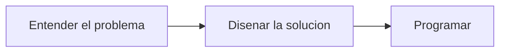
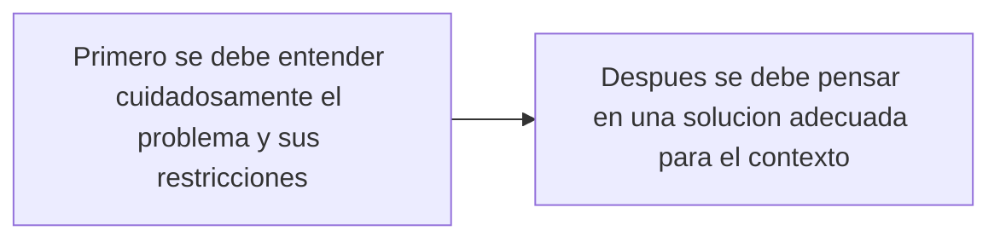
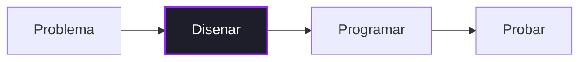
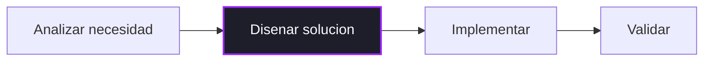
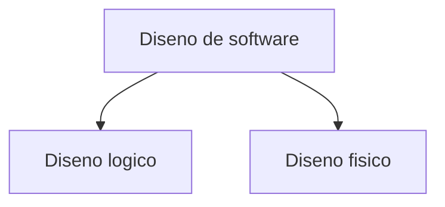
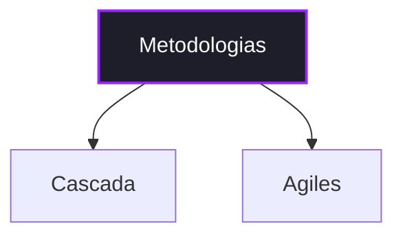
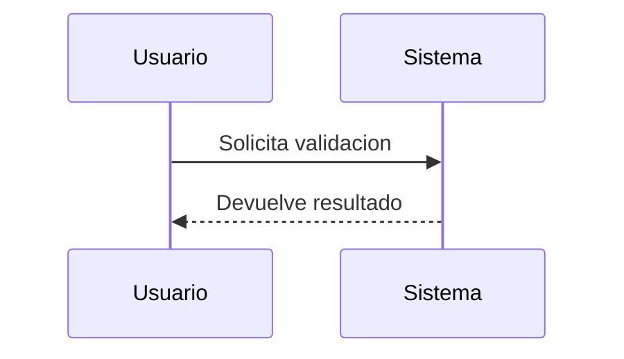

# Guia de Lecciones (ACC) - Diagramas Mermaid
**Aprendiendo C# con Charp (ACC)**

Esta guia documenta como crear diagramas Mermaid para lecciones de ACC de forma correcta, consistente y compatible con la estetica ya establecida en el sistema.

> Nota de alcance
> - Aqui documentamos como debe verse y redactarse una seccion `mermaid` dentro de una leccion.
> - La fuente visual de verdad parte de `AccStyles_global.css` y del componente `MermaidSection`.
> - Esta guia no reemplaza la guia tecnica general de lecciones; la complementa.

---

## 1) Como funciona Mermaid dentro de ACC

En ACC, Mermaid no se inserta como HTML manual dentro de `Teoria`, `Ejemplo` o `Practica`.
Se maneja como una seccion propia del renderizador.

Para usarla correctamente:

- agrega `mermaid` dentro de `OrdenSecciones`,
- llena `MermaidTitulo` si necesitas un encabezado corto,
- llena `MermaidDescripcion` si necesitas contexto breve,
- coloca el codigo del diagrama en `MermaidCodigo`.

Ejemplo:

```json
["charpDialog", "teoria", "mermaid", "ejemplo", "practica"]
```

> Importante:
> - `MermaidCodigo` debe contener solo codigo Mermaid puro.
> - No uses bloques Markdown como ```` ```mermaid ```` dentro de `MermaidCodigo`.
> - No agregues wrappers HTML manuales para la seccion Mermaid; ACC ya renderiza su propio contenedor.

---

## 2) Estetica ACC que el diagrama debe respetar

ACC ya tiene una identidad visual clara:

- fondos oscuros en la aplicacion,
- texto claro (`--acc-text`),
- bordes sutiles (`--acc-border`),
- acento principal morado (`--acc-brand-600`, `--acc-brand-700`),
- radios suaves (`--acc-radius`, `--acc-radius-sm`),
- sombras moderadas (`--acc-shadow`),
- tipografia limpia y legible.

La seccion Mermaid en ACC ya aplica su propio bloque visual:

- titulo y descripcion arriba del diagrama,
- una superficie separada con borde redondeado,
- scroll horizontal cuando el diagrama lo necesita,
- contenedor limpio para evitar que el SVG rompa el layout.

Eso significa que el autor no debe "decorar" de mas el Mermaid.
La estetica ACC ya la da el contenedor del sistema.

---

## 3) Regla principal de estilo

El diagrama debe verse como una extension natural de ACC, no como una lamina ajena.

Eso implica:

- claridad antes que espectacularidad,
- pocos colores y buen contraste,
- etiquetas cortas,
- una sola idea principal por diagrama,
- uso moderado del color para destacar solo lo importante.

Si un diagrama parece una infografia cargada, ya va fuera del estilo ACC.

---

## 4) Restricciones reales del renderizador

ACC renderiza Mermaid con reglas concretas. Al crear diagramas debes asumir estas limitaciones:

- `securityLevel: "strict"`
- `htmlLabels: false`
- `maxEdges: 200`
- tema automatico segun `prefers-color-scheme`

Consecuencias practicas:

- no uses HTML dentro de los labels,
- no dependas de `click`, scripts o interactividad incrustada,
- no metas etiquetas demasiado largas,
- no construyas diagramas gigantescos,
- no asumas que se van a respetar trucos visuales avanzados de HTML embebido.

Tambien ACC valida el codigo antes de renderizarlo. Si la sintaxis esta mal, el usuario vera una caja de error en lugar del diagrama.

---

## 5) Tipos de diagrama recomendados para lecciones

Los tipos mas utiles para ACC son:

- `flowchart` para procesos, secuencias de trabajo o relaciones causa-efecto,
- `sequenceDiagram` para interacciones paso a paso,
- `classDiagram` solo si el objetivo de la leccion realmente es estructural,
- `stateDiagram-v2` cuando se expliquen estados o ciclos.

Para la mayoria de las lecciones, el primer recurso recomendado es `flowchart`.
Es el mas legible, el mas pedagogico y el que mejor encaja con el estilo visual actual.

---

## 6) Reglas de composicion visual

### 6.1 Usa una sola idea por diagrama

Cada Mermaid debe explicar una sola cosa:

- un flujo,
- una comparacion,
- una jerarquia,
- una secuencia,
- un ciclo.

Si necesitas explicar varias ideas a la vez, separalas en varios diagramas o deja una parte en texto.

### 6.2 Manten el tamaño contenido

Recomendacion practica:

- ideal: entre 4 y 8 nodos,
- aceptable: hasta 10 o 12 si la estructura sigue siendo obvia,
- evita diagramas "poster" de una sola pieza.

Cuando el diagrama se vuelve ancho o denso, aunque ACC tenga scroll horizontal, la lectura pedagogica baja mucho.

### 6.3 Etiquetas cortas

Cada nodo debe leerse rapido.

Recomendado:

- 2 a 6 palabras por nodo,
- una idea por etiqueta,
- verbos claros cuando sea un proceso.

Evita:

- parrafos dentro de nodos,
- definiciones completas,
- oraciones demasiado largas.

Mejor:



Peor:



### 6.4 Direccion consistente

Usa la orientacion segun el tipo de idea:

- `LR` para procesos lineales o comparaciones horizontales,
- `TD` para jerarquias, pasos por niveles o clasificaciones.

No mezcles orientaciones sin una razon pedagogica clara.

---

## 7) Uso correcto del color en ACC

La paleta de ACC no debe convertirse en un arcoiris dentro del diagrama.
El color sirve para jerarquia visual, no para decoracion.

### 7.1 Colores ACC base a respetar

| Uso | Token ACC | Hex |
|-----|-----------|-----|
| fondo oscuro base | `--acc-bg-0` | `#0f0f0f` |
| superficie oscura | `--acc-surface-2` | `#1e1e2a` |
| borde | `--acc-border` | `#3f3f5a` |
| texto principal | `--acc-text` | `#f8fafc` |
| texto secundario | `--acc-text-muted` | `#cbd5e1` |
| acento principal | `--acc-brand-600` | `#9926fe` |
| acento secundario | `--acc-brand-700` | `#7c3aed` |
| info | `--acc-blue-600` | `#4f46e5` |
| exito | `--acc-success-500` | `#22c55e` |
| advertencia | `--acc-warning-500` | `#f59e0b` |
| error | `--acc-danger-500` | `#ef4444` |

### 7.2 Regla de color recomendada

Por defecto:

- deja que Mermaid use su tema automatico si el diagrama ya se entiende bien,
- si necesitas destacar algo, resalta solo 1 nodo o 1 grupo pequeño,
- usa trazos de color ACC y manten un fill sobrio.

### 7.3 Patron visual recomendado para nodos destacados

Cuando quieras resaltar un nodo dentro del estilo ACC, usa este enfoque:

- fill oscuro,
- texto claro,
- stroke con color de marca o color semantico,
- `stroke-width: 2px`.

Ejemplo:



Semanticos recomendados:

- exito: `stroke:#22c55e`
- advertencia: `stroke:#f59e0b`
- error: `stroke:#ef4444`
- informativo: `stroke:#4f46e5`

### 7.4 Lo que no se debe hacer

Evita:

- un color distinto por cada nodo,
- fills chillones o pastel ajenos a ACC,
- gradientes manuales dentro del Mermaid,
- estilos excesivos en todos los nodos al mismo tiempo.

Si todo esta resaltado, nada esta resaltado.

---

## 8) Tipografia y texto dentro del diagrama

La identidad tipografica de ACC se apoya en:

- `Sora` para encabezados,
- `Nunito` para lectura general,
- `JetBrains Mono` para codigo.

Dentro del SVG Mermaid no debes intentar forzar esas fuentes con hacks.
El autor debe enfocarse en:

- labels cortos,
- terminologia consistente,
- capitalizacion uniforme,
- texto legible sin depender de trucos HTML.

Regla recomendada:

- usa mayuscula inicial si el nodo representa una accion o concepto,
- evita mezclar estilos de redaccion dentro del mismo diagrama,
- usa los mismos terminos que ya aparecen en el texto de la leccion.

---

## 9) Estructura recomendada de una seccion Mermaid

Una buena seccion `mermaid` en ACC suele tener:

### 9.1 `MermaidTitulo`

Debe ser corto y funcional.

Buenos ejemplos:

- `Flujo basico del diseno`
- `Relacion entre capas`
- `Ciclo de validacion`

Evita titulos largos tipo subtitulo academico.

### 9.2 `MermaidDescripcion`

Debe preparar la lectura del diagrama en una sola idea.

Buenos patrones:

- que debe observar el alumno,
- cual es el orden clave,
- cual nodo tiene mas importancia,
- que comparacion se esta mostrando.

Ejemplo:

`Muestra el orden general del trabajo: entender el problema, disenar, programar y probar.`

### 9.3 `MermaidCodigo`

Debe contener solo el codigo Mermaid.

Ejemplo correcto:

```text
flowchart LR
    A["Entender el problema"] --> B["Disenar el sistema"]
    B --> C["Programar"]
    C --> D["Probar"]
```

Ejemplo incorrecto:

````text

````

---

## 10) Patrones recomendados por tipo de contenido

### 10.1 Procesos o fases

Usa `flowchart LR`.



### 10.2 Jerarquias o clasificaciones

Usa `flowchart TD`.



### 10.3 Comparaciones simples

Usa una bifurcacion sencilla.



### 10.4 Secuencias de interaccion

Usa `sequenceDiagram` solo si la interaccion temporal es el foco real.



Si la leccion no depende del orden temporal explicito, vuelve a `flowchart`.

---

## 11) Reglas de redaccion pedagogica

Un diagrama ACC no sustituye el texto; lo complementa.

Por eso:

- el diagrama debe reforzar una explicacion ya presentada,
- no debe introducir demasiados conceptos nuevos de golpe,
- debe ser interpretable en menos de 15 segundos,
- debe servir como mapa mental, no como bloque de lectura.

Pregunta de control util:

`Si quito el color, sigue entendiendose el diagrama?`

Si la respuesta es no, el diseño depende demasiado de adornos y no de estructura.

---

## 12) Buenas practicas tecnicas al escribir MermaidCodigo

- usa identificadores simples como `A`, `B`, `C` o `P1`, `P2`, `P3`,
- encierra labels en comillas si llevan espacios,
- manten indentacion consistente,
- deja una sola linea por relacion cuando sea posible,
- usa `style` solo cuando de verdad necesites destacar algo,
- revisa sintaxis antes de guardar en BD o script SQL.

Tambien:

- no metas comillas innecesarias dentro del texto,
- no satures el diagrama con `subgraph` si no aportan claridad,
- no repitas flechas equivalentes si el flujo ya se entiende.

---

## 13) Anti-patrones

Estos casos deben evitarse en ACC:

- diagramas con 12 colores distintos,
- nodos con definiciones completas en vez de conceptos cortos,
- dependencias visuales de HTML dentro de labels,
- diagramas enormes donde todo requiere scroll,
- uso de Mermaid solo "porque se ve bonito",
- styling manual mas protagonista que la idea pedagogica.

Mermaid debe aclarar la leccion, no competir con ella.

---

## 14) Ejemplo completo recomendado para ACC

```text
MermaidTitulo: Flujo basico del desarrollo

MermaidDescripcion: Muestra el orden general del trabajo y resalta que el diseno ocurre antes de programar.

MermaidCodigo:
flowchart LR
    A["Entender el problema"] --> B["Disenar el sistema"]
    B --> C["Programar"]
    C --> D["Probar"]
    D --> E["Ajustar si hace falta"]

    style B fill:#1e1e2a,stroke:#9926fe,stroke-width:2px,color:#f8fafc
```

Este ejemplo encaja bien con ACC porque:

- tiene una sola idea,
- usa etiquetas cortas,
- resalta solo el punto clave,
- mantiene contraste alto,
- no depende de hacks visuales,
- cabe bien dentro del contenedor renderizado por ACC.

---

## 15) Checklist rapido antes de publicar

- `OrdenSecciones` incluye `mermaid`.
- `MermaidCodigo` tiene sintaxis valida.
- El diagrama explica una sola idea.
- Las etiquetas son cortas.
- Hay como maximo un acento principal.
- El color usado pertenece a la logica visual de ACC.
- No se uso HTML embebido ni interactividad.
- `MermaidTitulo` y `MermaidDescripcion` son breves y utiles.
- El diagrama sigue entendiendose aun sin decoracion extra.

---

## 16) Criterio final

Si tienes duda entre dos versiones del diagrama, en ACC casi siempre gana la opcion:

- mas simple,
- mas clara,
- mas corta,
- mas cercana a la paleta ACC,
- menos decorativa y mas didactica.

Ese es el criterio correcto para Mermaid en las lecciones de ACC.
