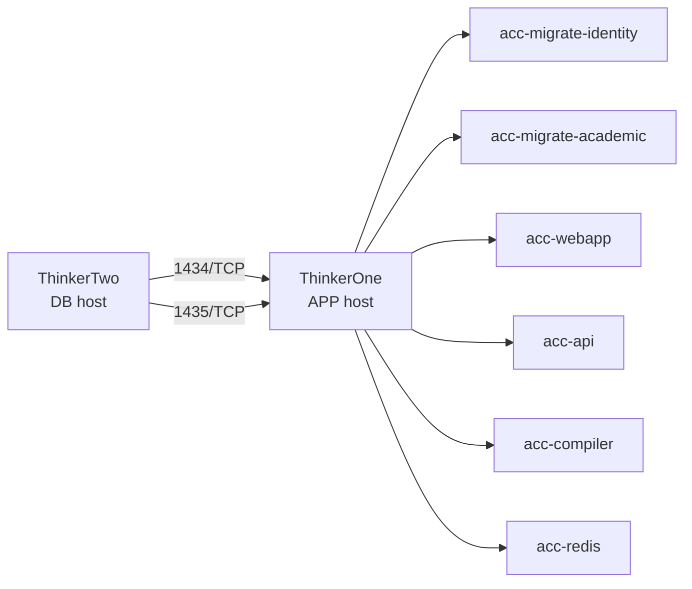

# Guia completa de despliegue real con Podman en 2 servidores Thinkers

## 1. Proposito de este documento

Este documento explica, paso a paso y sin asumir contexto previo, como desplegar este repositorio en un escenario real usando:

1. Dos servidores Fedora Server 43.
2. Dos contenedores SQL Server separados.
3. Un servidor para bases de datos.
4. Un servidor para la aplicacion.
5. Podman como runtime de contenedores.
6. `podman compose` como herramienta de orquestacion del stack.

La idea de esta guia no es solo "levantar contenedores", sino dejar claro:

1. Que se cambio en el repositorio para hacerlo desplegable.
2. Como encaja eso con tus nodos ThinkerOne y ThinkerTwo.
3. Que archivo usar.
4. Que variables configurar.
5. En que orden correr cada paso.
6. Como validar que realmente funciona.
7. Que errores son normales y como diagnosticarlos.

## 2. Alcance exacto de esta guia

Esta guia cubre el escenario siguiente:

1. `ThinkerTwo` se usa como servidor de base de datos.
2. `ThinkerOne` se usa como servidor de aplicacion.
3. La comunicacion entre ambos se hace por la red privada entre nodos, preferentemente Tailscale.
4. Las bases de datos viven en dos contenedores SQL Server distintos.
5. La aplicacion vive en contenedores Podman en el segundo servidor.
6. Las migraciones de Entity Framework se ejecutan automaticamente al desplegar.

Esta guia no cubre todavia:

1. Exposicion publica con HTTPS real por Internet.
2. Reverse proxy final con Caddy, Nginx o Traefik.
3. Alta disponibilidad.
4. Backup automatico de bases de datos.
5. CI/CD automatico.

Todo eso puede venir despues. Este documento deja el sistema listo para una prueba real entre tus dos servidores.

## 3. Resumen de la arquitectura resultante

La arquitectura que se busca dejar operativa es esta:



Traduccion operativa:

1. En `ThinkerTwo` viven dos SQL Server.
2. En `ThinkerOne` viven WebApp, API, Compiler, Redis y los jobs de migracion.
3. La WebApp habla con la API por red interna del compose.
4. La API y la WebApp se conectan a SQL remoto en `ThinkerTwo`.
5. La WebApp es el unico servicio expuesto al host en este punto.
6. API y Compiler quedan internos dentro de la red del compose.

## 4. Por que esta guia usa ThinkerTwo como DB y ThinkerOne como APP

Segun tus documentos:

1. `ThinkerOne` aparece como nodo de procesamiento y entorno de staging o validacion.
2. `ThinkerTwo` aparece como nodo estable o promovido.
3. `ThinkerTwo` ademas aparece como gateway de red e interconexion.
4. Tu red privada entre nodos contempla Tailscale y tambien el segmento `10.42.0.0/24`.

Por eso, para una primera prueba real, esta distribucion es razonable:

1. `ThinkerTwo` aloja las bases de datos porque es el nodo mas cercano al papel de infraestructura estable.
2. `ThinkerOne` aloja la aplicacion porque su rol contractual encaja mejor con validacion y pruebas de despliegue.

Nota importante:

1. Esta decision es operativa, no tecnica.
2. Tecnicamente se podria invertir.
3. Si despues quieres una politica de promocion mas estricta, puedes validar primero en `ThinkerOne` y despues mover la aplicacion estable a `ThinkerTwo`.
4. Esta guia se enfoca en hacer una primera implementacion real y repetible, no en cerrar toda la politica de promocion final.

## 5. Que se dejo preparado en el repositorio

Antes de esta guia, el repositorio se ajusto para que pueda vivir fuera de Aspire local.

### 5.1 Normalizacion de configuracion

Se quitaron dependencias directas de `localhost` y configuraciones hardcodeadas para que los servicios puedan vivir en otros hosts o contenedores.

Esto incluye:

1. Connection strings por variables de entorno.
2. Endpoints de servicios por variables de entorno.
3. JWT por variables de entorno.
4. Password SQL por variables de entorno o secreto.

Archivos relevantes:

1. `C:\Users\unesp\OneDrive\Desktop\Proyectos\Proyectos_Source\ACC-Complex\src\ACC.API\Program.cs`
2. `C:\Users\unesp\OneDrive\Desktop\Proyectos\Proyectos_Source\ACC-Complex\ACC.WebApp\ACC.WebApp\Program.cs`
3. `C:\Users\unesp\OneDrive\Desktop\Proyectos\Proyectos_Source\ACC-Complex\src\ACC.AppHost\Program.cs`
4. `C:\Users\unesp\OneDrive\Desktop\Proyectos\Proyectos_Source\ACC-Complex\src\ACC.Shared\Utils\ServiceEndpointsOptions.cs`
5. `C:\Users\unesp\OneDrive\Desktop\Proyectos\Proyectos_Source\ACC-Complex\src\ACC.Shared\Core\ServiceRoots.cs`
6. `C:\Users\unesp\OneDrive\Desktop\Proyectos\Proyectos_Source\ACC-Complex\ACC.WebApp\ACC.WebApp\Services\UsuarioSyncService.cs`

### 5.2 Estrategia de red/TLS

La estrategia elegida fue:

1. HTTP interno entre contenedores.
2. TLS terminado en proxy externo en una fase posterior.

Esto evita tener que administrar certificados dentro de cada contenedor ya desde el primer despliegue.

Config usada:

1. `Network__TlsTerminatedAtProxy=true` en contenedores.
2. `UseForwardedHeaders()` cuando aplique.
3. `UseHttpsRedirection()` solo cuando no se esta delegando TLS al proxy.

### 5.3 Containerfiles

Se crearon Containerfiles para:

1. API
2. WebApp
3. Compiler

Archivos:

1. `C:\Users\unesp\OneDrive\Desktop\Proyectos\Proyectos_Source\ACC-Complex\src\ACC.API\Containerfile`
2. `C:\Users\unesp\OneDrive\Desktop\Proyectos\Proyectos_Source\ACC-Complex\ACC.WebApp\ACC.WebApp\Containerfile`
3. `C:\Users\unesp\OneDrive\Desktop\Proyectos\Proyectos_Source\ACC-Complex\src\API_CompilerACC\Containerfile`
4. `C:\Users\unesp\OneDrive\Desktop\Proyectos\Proyectos_Source\ACC-Complex\.dockerignore`

### 5.4 Health checks

Los servicios ya exponen endpoints de salud tambien en produccion:

1. `/health`
2. `/alive`

Esto es importante porque Podman Compose los usa para decidir cuando un contenedor esta sano.

### 5.5 Migraciones automáticas por init jobs

Se agrego soporte para dos variables internas:

1. `Database__ApplyMigrationsOnStartup`
2. `Database__MigrateOnly`

Con eso, un contenedor puede arrancar, aplicar migraciones y salir exitosamente sin dejar la app en ejecucion.

Ese comportamiento se usa en dos jobs:

1. `acc-migrate-identity`
2. `acc-migrate-academic`

### 5.6 Compose para modo remoto

El archivo importante para esta guia es:

`C:\Users\unesp\OneDrive\Desktop\Proyectos\Proyectos_Source\ACC-Complex\podman-compose.remote-db.yml`

Ese archivo:

1. No levanta SQL local.
2. Levanta Redis local en el host de aplicacion.
3. Levanta migradores.
4. Levanta API.
5. Levanta WebApp.
6. Levanta Compiler.
7. Usa variables de entorno para conectarse a SQL remoto.

## 6. Archivos que vas a usar en el despliegue

### 6.1 Archivo compose principal para este escenario

`C:\Users\unesp\OneDrive\Desktop\Proyectos\Proyectos_Source\ACC-Complex\podman-compose.remote-db.yml`

Usalo cuando:

1. Las bases de datos viven en otro servidor.
2. Quieres desplegar la app real en un host y SQL en otro.

No lo uses cuando:

1. Quieras un laboratorio todo en un solo host.
2. Quieras levantar tambien SQL local.

### 6.2 Archivo de variables de ejemplo

`C:\Users\unesp\OneDrive\Desktop\Proyectos\Proyectos_Source\ACC-Complex\.env.example`

Sirve como plantilla para crear `.env`.

### 6.3 Guia corta ya existente

`C:\Users\unesp\OneDrive\Desktop\Proyectos\Proyectos_Source\ACC-Complex\Docs\podman-deploy.md`

Esa guia es breve. La guia actual es la version detallada y canónica para tu prueba real entre Thinkers.

## 7. Conceptos clave antes de empezar

### 7.1 Por que son 2 contenedores SQL y no 1

En este enfoque se levantan dos contenedores SQL separados:

1. Uno para Identity.
2. Uno para Academic.

Esto se hace por varias razones:

1. Tu arquitectura ya trata ambas bases como recursos distintos.
2. Evitas mezclar los dos catalogos dentro de la misma instancia durante esta primera prueba.
3. Mantienes una separacion clara entre datos de identidad y datos academicos.
4. Reproduces mejor la separacion logica que ya existe en el codigo.

Nota:

1. Tambien seria posible usar una sola instancia SQL Server con dos bases de datos.
2. Esa variante no es la que se documenta aqui.
3. Esta guia sigue el escenario mas explicito y menos ambiguo para probar tu arquitectura actual.

### 7.2 Por que 1434 y 1435

Cada contenedor SQL escucha internamente en `1433`.

Pero en el host no puedes publicar dos contenedores distintos en el mismo puerto `1433`, porque habria conflicto.

Por eso se hace esto:

1. SQL Identity: host `1434` -> contenedor `1433`
2. SQL Academic: host `1435` -> contenedor `1433`

Eso permite que desde el servidor de aplicacion puedas apuntar a dos endpoints diferentes:

1. `ThinkerTwo:1434` para Identity
2. `ThinkerTwo:1435` para Academic

### 7.3 Que significa `TU_SQL_PASSWORD`

`TU_SQL_PASSWORD` no es una password especial que el sistema espere.

Significa simplemente:

1. La password real que tu decidas usar para el usuario `sa` en SQL Server.
2. Esa misma password debe ponerse tambien en el `.env` del servidor de aplicacion.

Si no coincide exactamente:

1. Las migraciones van a fallar.
2. La API y la WebApp no podran conectarse a SQL.

### 7.4 Que significa `JWT_KEY`

`JWT_KEY` es la clave secreta usada para firmar y validar tokens JWT.

Debe ser:

1. Fuerte.
2. Larga.
3. Privada.
4. Nunca subida al repositorio.

Recomendacion minima:

1. 32 caracteres o mas.
2. Mezcla de mayusculas, minusculas, numeros y simbolos.

## 8. Requisitos previos exactos

Antes de correr nada, asegurate de que se cumpla lo siguiente.

### 8.1 En ambos servidores

1. Fedora Server 43 instalado.
2. Usuario con permisos `sudo`.
3. Acceso a Internet para descargar imagenes.
4. Tailscale instalado y unido a tu tailnet, si vas a usar Tailscale como via principal.
5. Hora del sistema razonablemente correcta.
6. Espacio suficiente en disco para imagenes y volumenes.

### 8.2 En el servidor DB

1. Podman instalado.
2. Puertos `1434/tcp` y `1435/tcp` accesibles solo desde el servidor APP.

### 8.3 En el servidor APP

1. Podman instalado.
2. Git instalado.
3. Acceso al repositorio.
4. Archivo `.env` creado localmente.

### 8.4 Validacion de Tailscale

En cada servidor puedes obtener la IP Tailscale con:

```bash
tailscale ip -4
```

Recomendacion:

1. Usa la IP Tailscale para la comunicacion entre ThinkerOne y ThinkerTwo.
2. No dependas de la LAN domestica si no es necesario.
3. No abras SQL a Internet publica.

## 9. Flujo real completo, sin saltos

El flujo real correcto es este:

1. Preparar el servidor DB.
2. Levantar los dos SQL Server.
3. Abrir firewall solo hacia el servidor APP.
4. Verificar que los puertos remotos responden.
5. Preparar el servidor APP.
6. Clonar el repositorio.
7. Crear `.env`.
8. Levantar el compose remoto.
9. Dejar que corran los migradores.
10. Verificar que ambos migradores terminaron en `Exited (0)`.
11. Verificar que API, WebApp, Compiler y Redis estan sanos.
12. Probar la aplicacion.

No inviertas ese orden.

No intentes primero arrancar la app si SQL remoto todavia no existe o no esta accesible.

## 10. Paso 1: preparar ThinkerTwo como servidor DB

En esta guia, `ThinkerTwo` sera el host de bases de datos.

### 10.1 Instalar Podman

```bash
sudo dnf -y update
sudo dnf -y install podman
```

Validar:

```bash
podman --version
```

### 10.2 Crear volumenes persistentes

Estos volumenes guardaran los datos aunque recrees los contenedores.

```bash
podman volume create sql_identity_data
podman volume create sql_academic_data
```

### 10.3 Elegir la password SQL

Debes definir una password fuerte para `sa`.

Ejemplo conceptual:

```text
MiPassword#2026Segura
```

No copies ese ejemplo literalmente. Genera una tuya.

Advertencia:

1. Esa password la vas a repetir exactamente en el `.env` del servidor APP.
2. Si luego cambias la password en DB, tambien debes cambiarla en APP.

### 10.4 Levantar contenedor SQL de Identity

```bash
podman run -d --name acc-sql-identity \
  -e ACCEPT_EULA=Y \
  -e MSSQL_SA_PASSWORD='TU_SQL_PASSWORD' \
  -p 1434:1433 \
  -v sql_identity_data:/var/opt/mssql \
  --restart=unless-stopped \
  mcr.microsoft.com/mssql/server:2022-latest
```

Explicacion:

1. `--name acc-sql-identity` da nombre fijo al contenedor.
2. `MSSQL_SA_PASSWORD` define la password del usuario `sa`.
3. `-p 1434:1433` publica ese SQL en el puerto `1434` del host.
4. `-v sql_identity_data:/var/opt/mssql` persiste los datos.
5. `--restart=unless-stopped` hace que el contenedor reinicie automaticamente.

### 10.5 Levantar contenedor SQL de Academic

```bash
podman run -d --name acc-sql-academic \
  -e ACCEPT_EULA=Y \
  -e MSSQL_SA_PASSWORD='TU_SQL_PASSWORD' \
  -p 1435:1433 \
  -v sql_academic_data:/var/opt/mssql \
  --restart=unless-stopped \
  mcr.microsoft.com/mssql/server:2022-latest
```

### 10.6 Verificar que ambos contenedores arrancaron

```bash
podman ps --format "{{.Names}} {{.Status}} {{.Ports}}"
```

Debes ver algo equivalente a:

1. `acc-sql-identity Up ... 0.0.0.0:1434->1433/tcp`
2. `acc-sql-academic Up ... 0.0.0.0:1435->1433/tcp`

Si un contenedor se cae:

```bash
podman logs acc-sql-identity
podman logs acc-sql-academic
```

Errores comunes:

1. Password SQL no cumple politicas de complejidad.
2. El puerto ya esta ocupado.
3. La imagen aun no termina de descargar.

## 11. Paso 2: abrir el firewall en ThinkerTwo solo para ThinkerOne

No abras los puertos SQL para todo el mundo.

Lo correcto es permitir solo la IP privada del servidor APP.

### 11.1 Obtener la IP Tailscale de ThinkerOne

En `ThinkerOne`:

```bash
tailscale ip -4
```

Supongamos que devuelve algo como `100.101.102.103`.

### 11.2 Abrir 1434 solo para ThinkerOne

En `ThinkerTwo`:

```bash
sudo firewall-cmd --permanent --add-rich-rule="rule family='ipv4' source address='100.101.102.103/32' port protocol='tcp' port='1434' accept"
```

### 11.3 Abrir 1435 solo para ThinkerOne

```bash
sudo firewall-cmd --permanent --add-rich-rule="rule family='ipv4' source address='100.101.102.103/32' port protocol='tcp' port='1435' accept"
```

### 11.4 Recargar firewall

```bash
sudo firewall-cmd --reload
```

### 11.5 Verificar reglas

```bash
sudo firewall-cmd --list-all
```

Nota:

1. Si `firewall-cmd` no existe, tu instalacion de Fedora puede no traer `firewalld` activo.
2. En ese caso primero debes confirmar que estrategia de firewall usa ese servidor antes de continuar.
3. No asumas que "si no hay firewall, entonces esta bien". Eso solo te deja sin control.

## 12. Paso 3: verificar conectividad desde ThinkerOne hacia ThinkerTwo

Antes de clonar el repo y levantar la app, valida la red.

### 12.1 Probar que el host responde

Desde `ThinkerOne`:

```bash
ping -c 4 IP_TAILSCALE_DE_THINKERTWO
```

### 12.2 Probar que el puerto 1434 esta accesible

```bash
nc -vz IP_TAILSCALE_DE_THINKERTWO 1434
```

### 12.3 Probar que el puerto 1435 esta accesible

```bash
nc -vz IP_TAILSCALE_DE_THINKERTWO 1435
```

Si `nc` no esta instalado:

```bash
sudo dnf -y install nmap-ncat
```

Si esto falla, no sigas con la app todavia. Primero resuelve:

1. Conectividad Tailscale.
2. Firewall.
3. Puertos publicados.
4. Contenedores SQL caidos.

## 13. Paso 4: preparar ThinkerOne como servidor APP

En esta guia, `ThinkerOne` sera el host de la aplicacion.

### 13.1 Instalar herramientas base

```bash
sudo dnf -y update
sudo dnf -y install git podman
```

Validar:

```bash
git --version
podman --version
```

### 13.2 Verificar soporte compose

Prueba:

```bash
podman compose version
```

Nota importante:

1. Segun la documentacion oficial de Podman, `podman compose` es un wrapper que llama a un compose provider externo.
2. Si ese comando falla, instala un provider compatible.

En muchos entornos Fedora, esto se resuelve con:

```bash
sudo dnf -y install podman-compose
```

Despues vuelve a probar:

```bash
podman compose version
```

### 13.3 Crear directorio de trabajo

```bash
mkdir -p ~/apps
cd ~/apps
```

### 13.4 Clonar el repositorio

```bash
git clone <URL_DE_TU_REPO> ACC-Complex
cd ACC-Complex
```

Si el repo es privado:

1. Usa HTTPS con token.
2. O usa SSH con llave previamente configurada.

## 14. Paso 5: crear el archivo `.env` en ThinkerOne

### 14.1 Copiar la plantilla

```bash
cp .env.example .env
```

### 14.2 Editar `.env`

```bash
nano .env
```

### 14.3 Contenido esperado de `.env`

Ejemplo completo:

```env
SQL_PASSWORD=TU_SQL_PASSWORD
JWT_ISSUER=ACC.API
JWT_AUDIENCE=ACC.Client
JWT_KEY=UNA_CLAVE_LARGA_Y_PRIVADA_DE_32_O_MAS_CARACTERES
WEBAPP_HTTP_PORT=8080
DB_SQL_USER=sa
DB_IDENTITY_HOST=IP_TAILSCALE_DE_THINKERTWO
DB_IDENTITY_PORT=1434
DB_ACADEMIC_HOST=IP_TAILSCALE_DE_THINKERTWO
DB_ACADEMIC_PORT=1435
```

### 14.4 Significado de cada variable

1. `SQL_PASSWORD`
   La password real del usuario `sa` en ambos SQL Server de ThinkerTwo.

2. `JWT_ISSUER`
   Emisor esperado por la aplicacion.

3. `JWT_AUDIENCE`
   Audiencia esperada por la aplicacion.

4. `JWT_KEY`
   Clave secreta con la que se firman y validan los tokens.

5. `WEBAPP_HTTP_PORT`
   Puerto del host de ThinkerOne donde se publicara `acc-webapp`.

6. `DB_SQL_USER`
   Usuario SQL. En esta guia se usa `sa`.

7. `DB_IDENTITY_HOST`
   Host o IP del SQL de Identity. Aqui debe ser ThinkerTwo.

8. `DB_IDENTITY_PORT`
   Puerto publicado del SQL de Identity. Aqui debe ser `1434`.

9. `DB_ACADEMIC_HOST`
   Host o IP del SQL de Academic. Aqui debe ser ThinkerTwo.

10. `DB_ACADEMIC_PORT`
    Puerto publicado del SQL de Academic. Aqui debe ser `1435`.

### 14.5 Reglas importantes para `.env`

1. No pongas comillas en los valores.
2. No subas `.env` al repositorio.
3. No uses una `JWT_KEY` debil.
4. `SQL_PASSWORD` debe coincidir exactamente con la usada al crear los contenedores SQL.
5. Si la password contiene caracteres especiales raros, valida que el parser de `.env` no los interprete de forma inesperada.

## 15. Paso 6: entender que va a hacer el compose remoto

Antes de ejecutar nada, es importante entender que hace:

`podman-compose.remote-db.yml`

Ese archivo levantara estos servicios en ThinkerOne:

1. `acc-redis`
2. `acc-migrate-academic`
3. `acc-migrate-identity`
4. `acc-compiler`
5. `acc-api`
6. `acc-webapp`

Y no levantara estos:

1. SQL Identity local
2. SQL Academic local

Eso es intencional.

La idea es:

1. Las bases de datos ya viven en ThinkerTwo.
2. ThinkerOne solo consume esas bases.

## 16. Paso 7: levantar el stack remoto en ThinkerOne

Desde la raiz del repo en ThinkerOne:

```bash
podman compose -f podman-compose.remote-db.yml --env-file .env up -d --build
```

Que hace este comando:

1. Lee el archivo compose remoto.
2. Lee variables desde `.env`.
3. Construye las imagenes de API, WebApp y Compiler.
4. Levanta Redis.
5. Corre los migradores.
6. Si los migradores terminan bien, levanta API y WebApp.

Nota:

1. La primera vez puede tardar bastante porque descargara imagenes base y compilara el proyecto.
2. No canceles el proceso solo porque tarde varios minutos.

## 17. Paso 8: validar las migraciones

Este paso es critico.

Los servicios `acc-migrate-identity` y `acc-migrate-academic` son jobs de una sola ejecucion.

El estado correcto para ambos es:

`Exited (0)`

### 17.1 Verificar estado

```bash
podman ps -a --format "{{.Names}} {{.Status}}" | grep acc-migrate
```

Debes ver algo equivalente a:

1. `acc-migrate-identity Exited (0) ...`
2. `acc-migrate-academic Exited (0) ...`

### 17.2 Si una migracion falla

Revisa logs:

```bash
podman logs acc-migrate-identity
podman logs acc-migrate-academic
```

Errores tipicos:

1. Password SQL incorrecta.
2. Host o puerto incorrecto.
3. SQL aun no estaba listo.
4. Firewall bloqueando.
5. Nombre de base o cadena de conexion mal formada.

Importante:

1. Si las migraciones no terminan correctamente, API y WebApp no deberian considerarse listas.
2. No ignores un migrador fallido aunque otros contenedores hayan quedado levantados.

## 18. Paso 9: verificar el estado de los servicios de aplicacion

### 18.1 Ver contenedores activos

```bash
podman ps --format "{{.Names}} {{.Status}}"
```

Debes ver, como minimo:

1. `acc-redis`
2. `acc-compiler`
3. `acc-api`
4. `acc-webapp`

### 18.2 Verificar health check de API

```bash
podman exec acc-api curl -fsS http://localhost:8080/alive
```

### 18.3 Verificar health check de WebApp

```bash
podman exec acc-webapp curl -fsS http://localhost:8080/alive
```

### 18.4 Verificar health check de Compiler

```bash
podman exec acc-compiler curl -fsS http://localhost:8080/alive
```

Si el comando no devuelve error, el servicio responde.

## 19. Paso 10: probar acceso a la aplicacion

La WebApp se publica al host con:

`WEBAPP_HTTP_PORT`

Si en `.env` pusiste:

```env
WEBAPP_HTTP_PORT=8080
```

Entonces la app deberia responder en:

```text
http://IP_DE_THINKERONE:8080
```

Si usas Tailscale:

```text
http://IP_TAILSCALE_DE_THINKERONE:8080
```

En este punto, esto sigue siendo HTTP plano.

No es aun el despliegue publico final con TLS.

## 20. Que esta pasando internamente cuando el stack arranca

El orden logico es este:

1. Se crea la red interna `acc-internal`.
2. Se levanta `acc-redis`.
3. Se construyen o reutilizan imagenes.
4. Corre `acc-migrate-academic`.
5. Corre `acc-migrate-identity`.
6. Se levanta `acc-compiler`.
7. Se levanta `acc-api`.
8. Se levanta `acc-webapp`.

Relaciones importantes:

1. `acc-api` depende del migrador academico, de Redis y de Compiler.
2. `acc-webapp` depende del migrador de identity, de Redis, de API y de Compiler.
3. API y WebApp usan SQL remoto, no SQL local.

## 21. Como actualizar despues de cambios en el repo

En ThinkerOne:

```bash
cd ~/apps/ACC-Complex
git pull
podman compose -f podman-compose.remote-db.yml --env-file .env up -d --build
```

Esto:

1. Baja los cambios nuevos.
2. Reconstruye imagenes si hace falta.
3. Relanza contenedores.

## 22. Como detener el stack

En ThinkerOne:

```bash
podman compose -f podman-compose.remote-db.yml --env-file .env down
```

Esto no borra:

1. El repo.
2. Las imagenes construidas.
3. Los volumenes de Redis.
4. Las bases de datos remotas en ThinkerTwo.

## 23. Como volver a correr las migraciones manualmente

Si por algun motivo necesitas repetir un migrador:

```bash
podman compose -f podman-compose.remote-db.yml --env-file .env run --rm acc-migrate-identity
podman compose -f podman-compose.remote-db.yml --env-file .env run --rm acc-migrate-academic
```

Usa esto con cuidado.

No lo hagas repetidamente sin revisar por que fallo el despliegue original.

## 24. Troubleshooting detallado

### 24.1 El comando `podman compose` no existe o falla

Posibles causas:

1. Falta provider de compose.
2. `podman-compose` no esta instalado.

Accion:

```bash
sudo dnf -y install podman-compose
podman compose version
```

### 24.2 Los migradores fallan por login

Sintoma:

1. Logs con errores de autenticacion SQL.

Causas probables:

1. `SQL_PASSWORD` no coincide con la usada en ThinkerTwo.
2. `DB_SQL_USER` no es correcto.

Revision:

1. Revisa `.env`.
2. Revisa los `podman run` con que creaste SQL.

### 24.3 Los migradores fallan por timeout o red

Sintoma:

1. No pueden abrir conexion.

Revisa:

1. `DB_IDENTITY_HOST`
2. `DB_IDENTITY_PORT`
3. `DB_ACADEMIC_HOST`
4. `DB_ACADEMIC_PORT`
5. Firewall en ThinkerTwo
6. Tailscale activo

Comandos utiles:

```bash
nc -vz DB_HOST 1434
nc -vz DB_HOST 1435
```

### 24.4 SQL parece arriba pero la app no conecta

Revisa:

1. Que el contenedor publique realmente el puerto correcto.
2. Que la base no haya quedado reiniciando.
3. Que la password cumpla politicas y SQL no haya rechazado el arranque inicial.

Comandos:

```bash
podman ps --format "{{.Names}} {{.Status}} {{.Ports}}"
podman logs acc-sql-identity
podman logs acc-sql-academic
```

### 24.5 WebApp no carga pero API si

Revisa:

1. Logs de `acc-webapp`.
2. Health check de `acc-webapp`.
3. Connection string de Identity.
4. JWT variables.

### 24.6 API no carga pero migracion academica si

Revisa:

1. Logs de `acc-api`.
2. Estado de `acc-compiler`.
3. Estado de `acc-redis`.

## 25. Advertencias importantes

### 25.1 Esto aun no expone HTTPS publico

En esta fase:

1. El trafico interno entre contenedores es HTTP.
2. La WebApp expone HTTP al host.
3. Si vas a abrir esto a Internet publica, debes poner un reverse proxy con TLS delante.

### 25.2 `TrustServerCertificate=true`

Las cadenas de conexion actuales usan `TrustServerCertificate=true`.

Eso facilita la primera conexion entre nodos, pero significa:

1. No estas validando una PKI completa hacia SQL Server.
2. Es aceptable para laboratorio controlado o red privada cerrada.
3. Si despues formalizas seguridad de transporte hacia SQL, eso debe revisarse.

### 25.3 No subir secretos al repositorio

Nunca subas:

1. `.env`
2. Passwords SQL reales
3. `JWT_KEY` real
4. Tokens o credenciales del servidor

### 25.4 No abrir SQL a redes no necesarias

Los puertos `1434` y `1435` solo deben aceptar trafico desde ThinkerOne o desde las IPs administrativas que realmente necesites.

## 26. Sugerencias operativas

### 26.1 Para esta primera prueba real

Hazla asi:

1. ThinkerTwo como DB.
2. ThinkerOne como APP.
3. Acceso entre nodos por Tailscale.
4. Acceso a WebApp solo desde red privada.

### 26.2 Para una siguiente fase

Despues de que esto funcione:

1. Agrega Caddy o Nginx delante de `acc-webapp`.
2. Cierra el puerto HTTP directo al exterior.
3. Deja HTTPS publico solo en el proxy.

### 26.3 Para dejarlo mas repetible

Mas adelante conviene crear:

1. Un script para inicializar ThinkerTwo como host DB.
2. Un script para desplegar ThinkerOne como host APP.
3. Un checklist de smoke test.
4. Un procedimiento de backup y restore.

## 27. Preguntas frecuentes

### 27.1 Puedo mover el repo con `.tar` en lugar de `git clone`?

Si, pero no es lo ideal.

Recomendacion:

1. Usa `git clone` si el servidor tiene acceso al repo.
2. Usa `.tar.gz` solo si estas en un entorno aislado u offline.

### 27.2 Puedo usar una password SQL distinta a la que se uso en desarrollo?

Si.

La condicion es:

1. Debe ser la misma en el contenedor SQL.
2. Debe ser la misma en `SQL_PASSWORD` dentro del `.env` del servidor APP.

### 27.3 Aspire sigue siendo util?

Si.

Aspire sigue siendo util para:

1. Desarrollo local.
2. Orquestacion de dependencias en entorno de desarrollo.
3. Pruebas locales.

Podman en esta guia se usa para el despliegue real.

## 28. Checklist final de exito

Considera que la prueba fue exitosa si puedes marcar todo esto:

1. `ThinkerTwo` tiene dos contenedores SQL activos.
2. `ThinkerOne` alcanza `ThinkerTwo:1434` y `ThinkerTwo:1435`.
3. `.env` existe en ThinkerOne y tiene valores correctos.
4. `podman compose -f podman-compose.remote-db.yml --env-file .env up -d --build` termina sin error fatal.
5. `acc-migrate-identity` termina en `Exited (0)`.
6. `acc-migrate-academic` termina en `Exited (0)`.
7. `acc-api` responde en `/alive`.
8. `acc-webapp` responde en `/alive`.
9. `acc-compiler` responde en `/alive`.
10. Puedes abrir la WebApp desde el puerto configurado.

## 29. Estado actual del repositorio respecto a esta guia

Al momento de escribir este documento:

1. El repositorio ya tiene los `Containerfile` necesarios.
2. El repositorio ya tiene el compose remoto.
3. El repositorio ya tiene soporte para migraciones automaticas.
4. El repositorio ya tiene soporte para configuracion por variables de entorno.
5. Esta guia describe el flujo esperado para usar todo eso en un caso real.

## 30. Resumen ejecutivo

Si quieres la version corta del proceso, es esta:

1. En ThinkerTwo instalas Podman.
2. En ThinkerTwo levantas `acc-sql-identity` en `1434` y `acc-sql-academic` en `1435`.
3. En ThinkerTwo abres firewall solo para ThinkerOne.
4. En ThinkerOne instalas Git y Podman.
5. En ThinkerOne clonas el repo.
6. En ThinkerOne creas `.env` con la password SQL real y los hosts/puertos de ThinkerTwo.
7. En ThinkerOne corres `podman compose -f podman-compose.remote-db.yml --env-file .env up -d --build`.
8. Verificas que ambos migradores terminan en `Exited (0)`.
9. Verificas salud de API, WebApp y Compiler.
10. Pruebas la WebApp desde el puerto publicado.

Si alguno de esos pasos falla, no avances al siguiente hasta entender por que fallo el actual.
