<p align="center">
  
  
  
  
</p>

<h1 align="center">🦈 Aprendiendo C# con Charp</h1>

<p align="center">
  <strong>Plataforma educativa interactiva para aprender C# de forma clara y progresiva.</strong>
</p>

<p align="center">
  <a href="#-características-principales">Características</a> •
  <a href="#-arquitectura">Arquitectura</a> •
  <a href="#-instalación">Instalación</a> •
  <a href="#-estructura-del-proyecto">Estructura</a> •
  <a href="#-tecnologías">Tecnologías</a> •
  <a href="#-contribución">Contribución</a>
</p>

<p align="center">
  <a href="https://deepwiki.com/germann-ux/ACC-Complex">
    
  </a>
</p>

---

## 📖 Descripción

**Aprendiendo C# con Charp** es una plataforma educativa completa diseñada para enseñar C# de manera interactiva y personalizada. Cuenta con un asistente de IA educativo llamado **Charp** 🦈, que asiste a los estudiantes a través de un currículo estructurado basado en la **Taxonomía de Bloom**.

La plataforma soporta múltiples modalidades de aprendizaje: desde lecciones teóricas hasta compilación de código en tiempo real, evaluaciones automatizadas y aulas virtuales para colaboración entre estudiantes y docentes.

---

## ✨ Características Principales

### 🤖 Inteligencia Artificial Educativa
- Asistente **Charp** integrado con servicios de IA externos
- Retroalimentación personalizada y adaptativa
- Sugerencias de aprendizaje basadas en el progreso del estudiante

### 📚 Sistema de Lecciones Dinámicas
- Contenido basado en bloques ordenados con `OrdenSecciones`
- Metodología estructurada: teoría → ejemplos → práctica → evaluación
- Estilos visuales consistentes con alertas didácticas

### 🧪 Compilador en Tiempo Real
- Compilación de código C# usando **Roslyn**
- Ejecución segura en contenedor aislado
- Retroalimentación inmediata de errores y resultados

### 📅 Gestión Académica Completa
- Agenda y seguimiento de progreso
- Aulas virtuales y gestión de grupos
- Sistema de tareas y evaluaciones
- Reportes de desempeño

### 🔐 Sistema de Autenticación Robusto
- ASP.NET Identity con roles (estudiante, docente, administrador)
- Autenticación basada en tokens JWT
- Gestión de permisos granular

### 🌐 Multiplataforma
- **Web**: Blazor WebAssembly (SPA)
- **Escritorio**: Windows, macOS, Linux
- **Móvil**: Android, iOS
- Todo a través de MAUI Blazor

### 📊 Observabilidad y Resiliencia
- Telemetría distribuida con **OpenTelemetry**
- Logging estructurado con **Serilog**
- Health checks automáticos
- Políticas de resiliencia integradas

---

## 🏗 Arquitectura

La solución sigue un enfoque de **Clean Architecture distribuida** con servicios orquestados mediante **.NET Aspire**.


### 📌 Descripción de Proyectos

| Capa | Proyecto | Descripción |
|------|----------|-------------|
| **Frontend** | `ACC.WebApp.Client` | SPA en Blazor WebAssembly - Cliente principal web |
| **Frontend** | `ACC.MultiPlataform` | App MAUI Blazor para móvil y escritorio |
| **Backend** | `ACC.WebApp` | Servicio de autenticación, registro y gestión de usuarios |
| **Backend** | `ACC.API` | API de contenido educativo (módulos, lecciones, tareas) |
| **Backend** | `API_CompilerACC` | Servicio de compilación C# en tiempo real |
| **Datos** | `ACC.Data` | Entidades, DbContext, migraciones EF Core |
| **Compartido** | `ACC.Shared` | DTOs, interfaces, enums y tipos comunes |
| **Compartido** | `ACC.ExternalClients` | Clientes para APIs externas (IA de Charp) |
| **Infraestructura** | `ACC.ServiceDefaults` | Configuración de resiliencia, telemetría, health checks |
| **Orquestación** | `ACC.AppHost` | Host de Aspire - orquesta todos los servicios |
| **Pruebas** | `ACC.Tests` | Pruebas unitarias con xUnit + Moq |

---

## 🚀 Instalación

### Prerrequisitos

- [.NET 8 SDK](https://dotnet.microsoft.com/download/dotnet/8.0) o superior
- [Docker Desktop](https://www.docker.com/products/docker-desktop/) (para Redis y SQL Server)
- [Visual Studio 2022](https://visualstudio.microsoft.com/) (recomendado) o VS Code
- [SQL Server](https://www.microsoft.com/sql-server) (opcional si usas Docker)

### Pasos de Instalación

1. **Clonar el repositorio**
   ```bash
   git clone https://github.com/germann-ux/ACC-Complex.git
   cd ACC-Complex
   ```

2. **Restaurar dependencias**
   ```bash
   dotnet restore
   ```

3. **Configurar variables de entorno**
   
   Crear archivo `appsettings.Development.json` en los proyectos necesarios o usar User Secrets:
   ```bash
   dotnet user-secrets set "ConnectionStrings:DefaultConnection" "tu_cadena_de_conexion"
   ```

4. **Ejecutar las migraciones**
   ```bash
   cd src/ACC.Data
   dotnet ef database update
   ```

5. **Iniciar la aplicación con Aspire**
   ```bash
   cd src/ACC.AppHost
   dotnet run
   ```

6. **Acceder a la aplicación**
   - Dashboard de Aspire: `https://localhost:17096`
   - Aplicación Web: `https://localhost:5001`

---

## 📁 Estructura del Proyecto

```
ACC-Complex/
├── 📂 src/
│   ├── ACC.API/              # API de contenido educativo
│   ├── ACC.AppHost/          # Orquestador Aspire
│   ├── ACC.Data/             # Capa de datos (EF Core)
│   ├── ACC.ExternalClients/  # Clientes de APIs externas
│   ├── ACC.Shared/           # Código compartido
│   └── data/                 # Scripts y datos semilla
│
├── 📂 ACC.WebApp/
│   ├── ACC.WebApp/           # Backend de autenticación
│   └── ACC.WebApp.Client/    # Cliente Blazor WASM
│
├── 📂 ACC.ServiceDefaults/   # Configuración transversal
│
├── 📂 tests/
│   └── ACC.Tests/            # Pruebas unitarias
│
├── 📄 ACC.sln                # Solución principal

└── 📄 README.md              # Este archivo
```

---

## 👨‍💻 Tecnologías

### Backend
| Tecnología | Versión | Uso |
|------------|---------|-----|
| .NET | 8.0 | Framework principal |
| ASP.NET Core | 8.0 | APIs REST |
| Entity Framework Core | 9.0 | ORM y migraciones |
| ASP.NET Identity | 8.0 | Autenticación y autorización |
| Roslyn | Latest | Compilación dinámica de C# |
| AutoMapper | 12.0 | Mapeo objeto-objeto |
| Serilog | Latest | Logging estructurado |
| OpenTelemetry | 1.11 | Telemetría distribuida |

### Frontend
| Tecnología | Versión | Uso |
|------------|---------|-----|
| Blazor WebAssembly | 8.0 | SPA web |
| .NET MAUI Blazor | 8.0 | Apps multiplataforma |
| Bootstrap | 5.x | Framework CSS |

### Infraestructura
| Tecnología | Versión | Uso |
|------------|---------|-----|
| .NET Aspire | 9.2 | Orquestación de servicios |
| SQL Server | 2022 | Bases de datos (Identity + Académica) |
| Redis | 7.x | Caché distribuido |
| Docker | Latest | Contenedorización |

---

## 🔄 Flujo de Trabajo

```mermaid
%%{init: {
  "theme": "dark",
  "themeVariables": {
    "background": "#0a0a0f",
    "mainBkg": "#141420",
    "secondBkg": "#10101a",

    "actorBkg": "#141420",
    "actorBorder": "#4cc9f0",
    "actorTextColor": "#e5e7eb",
    "actorLineColor": "#4cc9f0",

    "signalColor": "#e5e7eb",
    "signalTextColor": "#e5e7eb",

    "labelBoxBkgColor": "#10101a",
    "labelBoxBorderColor": "#2a2a40",
    "labelTextColor": "#cbd5e1",

    "noteBorderColor": "#2a2a40",
    "noteBkgColor": "#0f0f1a",
    "noteTextColor": "#cbd5e1",

    "activationBorderColor": "#4cc9f0",
    "activationBkgColor": "#141420",

    "loopTextColor": "#cbd5e1",
    "sequenceNumberColor": "#7dd3fc",
    "lineColor": "#4cc9f0",
    "textColor": "#e5e7eb",
    "fontSize": "14px"
  }
}}%%

sequenceDiagram
    autonumber

    participant U as Usuario
    participant C as Cliente<br/>Blazor / MAUI
    participant A as ACC.WebApp<br/>Auth Service
    participant S as SyncService
    participant IdDB as Identity DB
    participant AcDB as Academic DB
    participant E as ACC.API<br/>Content Service

    rect rgb(20,20,40)
    Note over U,AcDB: Phase 1 — User Registration and Academic Profile Sync
    end

    U->>+C: Complete registration form
    C->>+A: POST /Account/Register<br/>{ email, password, profile }

    A->>+IdDB: Create Identity user
    IdDB-->>-A: User created (userId)

    A->>+S: SyncUserAsync(userId)
    S->>+AcDB: INSERT academic profile<br/>linked to Identity ID
    AcDB-->>-S: Academic profile created
    S-->>-A: Sync completed

    A->>U: Send confirmation email
    A-->>-C: Registration success
    C-->>-U: Show confirmation message


    rect rgb(18,18,34)
    Note over U,E: Phase 2 — Authentication and Session Establishment
    end

    U->>+C: Enter credentials and login
    C->>+A: POST /Account/Login<br/>{ email, password }

    A->>+IdDB: Validate credentials<br/>and retrieve claims
    IdDB-->>-A: User valid + roles

    A-->>-C: JWT + RefreshToken<br/>{ token, expiry, user }
    C-->>-U: Login success


    rect rgb(16,16,30)
    Note over C,E: Phase 3 — Secure Educational Content Access
    end

    U->>+C: Navigate to lessons
    C->>+E: GET /api/lessons<br/>Authorization: Bearer {token}

    E->>E: Validate JWT<br/>and extract userId

    E->>+AcDB: Query lessons and progress<br/>WHERE userId = {id}
    AcDB-->>-E: Lessons + progress data

    E-->>-C: 200 OK<br/>{ lessons, progress, stats }
    C-->>-U: Render content and progress UI
```

---

## 📖 Metodología de Lecciones

Las lecciones están diseñadas siguiendo la **Taxonomía de Bloom** para asegurar un aprendizaje progresivo:

| Nivel | Componente | Descripción |
|-------|------------|-------------|
| 1️⃣ | **Teoría** | Conceptos fundamentales explicados de forma clara |
| 2️⃣ | **Ejemplos** | Código comentado con casos de uso reales |
| 3️⃣ | **Práctica Guiada** | Ejercicios paso a paso con ayuda |
| 4️⃣ | **Actividad** | Retos independientes para aplicar lo aprendido |
| 5️⃣ | **Evaluación** | Verificación del conocimiento adquirido |
| 6️⃣ | **Fomentadores** | Material adicional y recursos de profundización |

---

## 🧪 Pruebas

```bash
# Ejecutar todas las pruebas
dotnet test

# Ejecutar con cobertura
dotnet test --collect:"XPlat Code Coverage"

# Ejecutar pruebas específicas
dotnet test --filter "FullyQualifiedName~ACC.Tests.NombreDelTest"
```

---

## 🤝 Contribución

¡Las contribuciones son bienvenidas! Por favor, sigue estos pasos:

1. **Fork** el repositorio
2. Crea una rama para tu feature (`git checkout -b feature/NuevaCaracteristica`)
3. Realiza tus cambios y haz commit (`git commit -m 'Agregar nueva característica'`)
4. Push a la rama (`git push origin feature/NuevaCaracteristica`)
5. Abre un **Pull Request**

---

## 👥 Equipo

<table>
  <tr>
    <td align="center">
      <strong>Desarrolladores</strong><br/>
      Germán Uriel Evangelista Martínez<br/>
      Aldo Juan Figueroa Espinoza
    </td>
    <td align="center">
      <strong>Asesores</strong><br/>
      Francisco Javier Tafolla Granados (Técnico)<br/>
      José Manuel González Zaragoza (Metodológico)
    </td>
  </tr>
</table>

---

## 📄 Propiedad Intelectual

Este proyecto es propiedad intelectual exclusiva. Todos los derechos están reservados.
La licencia MIT ya no está vigente para este proyecto.

---

## 📌 Estado del Proyecto

<p align="center">
  
  
</p>

**🛠 En desarrollo activo** - Se aceptan sugerencias, mejoras y colaboración.

> ¡Tu retroalimentación es bienvenida! Abre un [issue](https://github.com/germann-ux/ACC-Complex/issues) o contáctanos directamente.

---

<p align="center">
  <strong>Hecho con ❤️ para la comunidad educativa de C#</strong>
</p>

<p align="center">
  <a href="https://deepwiki.com/germann-ux/ACC-Complex">
    
  </a>
</p>
